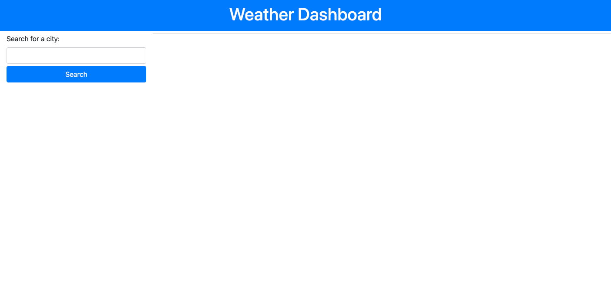
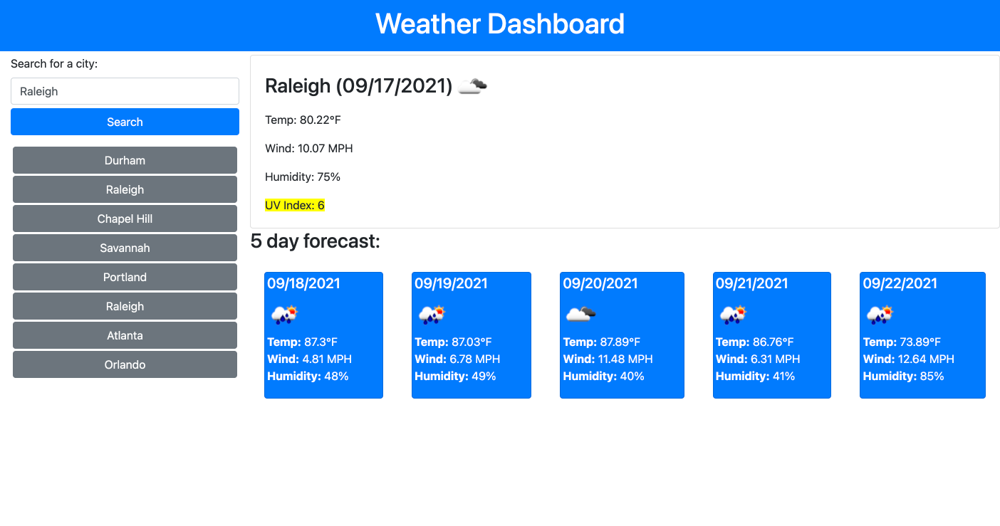

# Weather Dashboard (Homework 6)

This project is a weather dashboard. The user is first displayed a page where they an enter a city that they want to search for the weather of. When they click search the right hand side of the page populates two sections. The top section shows the weather for the current day in the city that they searched. The bottom section shows the forecast for the next 5 days. The current weather shows the date, temp, wind speed, humidity and UV index. If the UV index is greater than or equal to 7 it will show in red. If the UV index is between  3 and 7 it will show as yellow. If the UV index is below 3 then it will show green. The bottom section that shows the 5 day forecast displays the date, an icon of predicted weather, temp, wind speed and humidity. 

After a user searches for a city it will be added to the local storage. When they search for a new city all previously searched cities will display under the search area. The user has the ability to search for past cities with those buttons. 

View the Weather Dashboard here:
[Weather Dashboard](https://kmwine02.github.io/homework06/)

and the repository here:
[GitHub Repository](https://github.com/kmwine02/homework06) 

